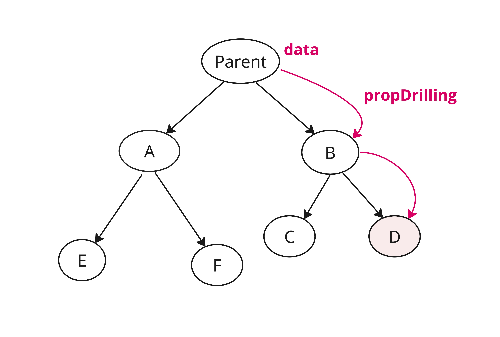

### Context API

Context allows you to share data among multiple react components
avoiding prop-drilling



**Switching between light and dark theme**

```js
// Step1: Create theme context
const ThemeContext = React.createContext();

// Step2: Create a context provider
const ThemeContextProvider = ({ children }) => {
  const theme = 'light';
  return (
    <ThemeContext.Provider value={theme}>{children}</ThemeContext.Provider>
  );
};

// Wrap the components in theme provider

const App = () => {
  return (
    <ThemeContextProvider>
      <MyComponent1 />
      <MyComponent2 />
    </ThemeContextProvider>
  );
};
```

**Consuming Context**

```js
const MyComponent1 = () => {
  const { theme } = useContext(ThemeContext);
};
```

**Using hook**

If you forget to wrap your components in Provider, you don't get any error related to that. It makes difficult to debug things.

So its better to create a hook like below:

```js
const useMyContext = () => {
  const context = useContext(MyContext);
  if (context == null) {
    throw new Error('useMyContext must be wrapped inside a provider');
  }

  return context;
};
```

> you can call useMyContext() hook directly where you want to consume context vaues.
> This way you also get relevant error message if you forget to wrap component inside a provider in your code or in your test case.

---

### Preventing unnecessary re-renders caused by Context

**Memoise provider value**
Lets say the component A contains context Provider. If component A rerenders , it will also make the components wrapped inside context provider to rerender.
In order to prevent that, provider values should be momoised.

```js
const ComponentA = () => {
  const memoValue = useMemo(() => {
    value;
  }, []);

  return <Context.Provider value={memoValue}>{children}</Context.Provider>;
};
```

**Use multiple context**

if context value is a combination of getter and setter like

`const [data, setData] = useState({})`

it can be split into multiple Providers. In this way consumers only consuming the data won't rerender when data changes.
