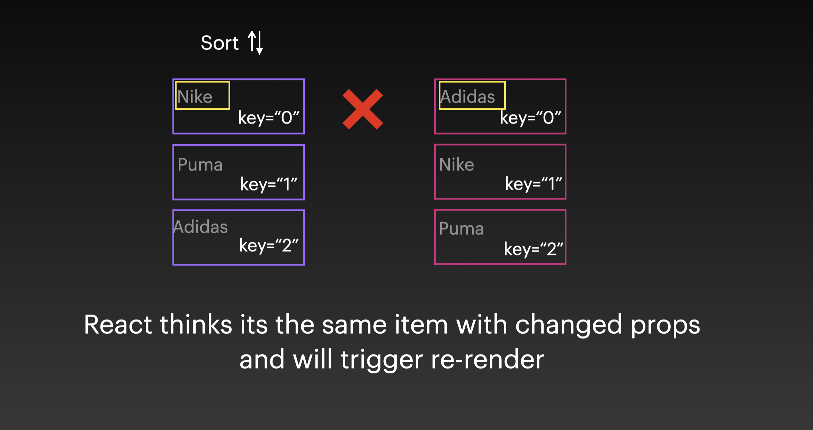
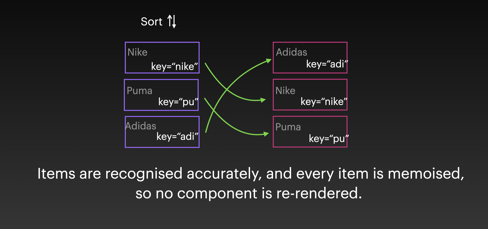

### Improvng performance of lits

```js
<ul>
  {list.map((item) => (
    <ListItem key={item.id} item={item} />
  ))}
</ul>
```

Its important to use **key** attribute along with each item of the list . It helps react to identify each element and effectively determine which element has been changes(added , removed or updated).

> If key attribute is not provided, react might have to rerender the entire list causing performance issues.

### But, Just providing key attribute is not enough

Apply rest of the optimisation techniques, wrap list elements in React.memo to prevernt extra rerenders

### Deciding what should be the key

Value of key should be unique and should be consistent between renders.
Often we use item's `id` or `index` as a key.

Using index as a key is fine as long as the list is static i.e there is no adding, removing or sorting elements involved.

For dynamic lists , using index as a key can lead to unexpected results and poor performance




