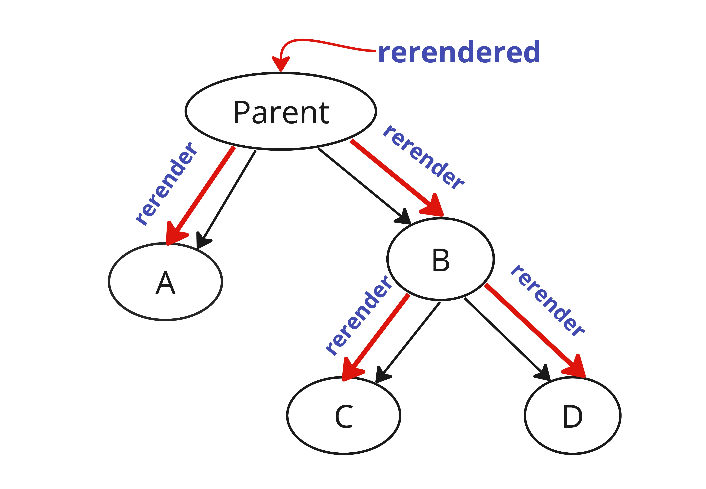

### Optimising rerenders

Whenever there is a state update, react does a rerender. If the parent rerenders , all of the its children are rendered as well regardless of whether their own props have changed or not.



```js
const Parent = () => {
  const [color, setColor] = useState('red');

  return (
    <>
      <ChildA color={color} onClick={setColor}>
      <ChildB />
    </>
  )
}

```

> ChildB is also rerendered when childA is clicked even though ChildB props are not changed

### Solution 1

**Pushing state down**

Pushing state as much as down in the dom tree will prevent unnecessary rerenders.
In this case moving state down to **_ChildA_** ensures that _ChildB_ is not rerendered

```js
const Parent = () => {
  return (
    <>
      <ChildA />
      <ChildB />
    </>
  );
};
```

```js
const ChildA = () => {
  const [color, setColor] = useState('red');

  return (
    ...
  );
};
```

### Solution 2

**Using React.Memo**

If a component is wrapped inside React Memo `React.Memo(<dummy_component>)` , react only rerenders it when its props are changed.

```js

const ChildB = () => {
  return ....
}

export const MemoedChildB = React.memo(ChildB)

```

```js
const Parent = () => {
  return (
    <>
      <ChildA />
      <MemoedChildB />
    </>
  );
};
```

### Solution 3

Passing component as {children} prop.

```js
<ChildA>
  <ChildB>
</ChildA>
```

```js
const ChildA = ({ children }) => {
  const [color, setColor] = useState('red');
  return (
    <div onClick={setColor}>
      // some code
      {children}
    </div>
  );
};
```

> Even when `ChildA` component's state changes, `ChildB` is not rerendered because its passed as `children` prop.

---

### Improving re-renders using useCallback and useMemo

**useCallback** memoises the functions ensuring function reference stays same during rerenders of a component.

**useMemo** memoises the computed value of the functions ensuring the value stays same during different rerenders.

```js
const Parent = () => {

  const callbackFn = useCallback(() => {...}, [])

  const value = useMemo(() => {}, [])

  return (
    <>
      <ChildA />
      <MemoedChildB value={value} callback={callbackFn}/>
    </>
  );
};
```

Even if the child component is memoised , it can still rerender if the props passed are not primitive values

Because of Javascript equality doesn't hold the same for objects and functions

{} != {}

> So all the non primitive props need to be wrapped in useMemo or useCallback(if its a function)

---
