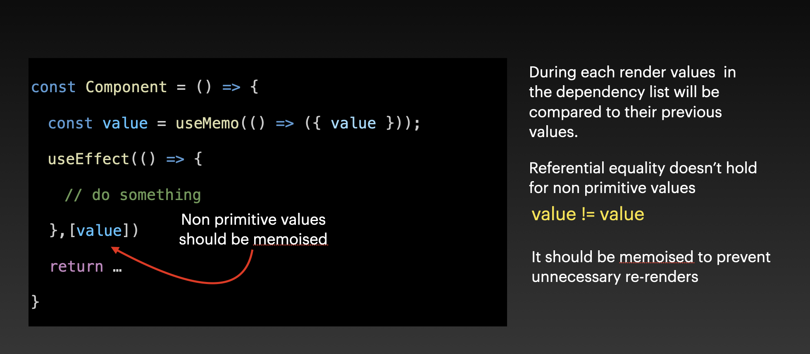

### Optimising rerenders

<b>What is Rerendering?</b>

Browser painting stuff on the screen to display it to the user.

<b>Two Stages</b>

- Initial Render - When a component on the screen for the first time.
- Re-render - When the existing component updates due to some user interaction




<b>When does a component rerender?</b>

1. When there is a change in state

2. When the parent component rerendrs

Whenever there is a state update, react does a rerender. If the parent rerenders , all of the its children are rendered as well regardless of whether their own props have changed or not.


```js
const Parent = () => {
  const [color, setColor] = useState('red');

  return (
    <>
      <ChildA color={color} onClick={setColor}>
      <ChildB />
    </>
  )
}

```

> ChildB is also rerendered when childA is clicked even though ChildB props are not changed

### Solution 1

**Pushing state down**

Pushing state as much as down in the dom tree will prevent unnecessary rerenders.
In this case moving state down to **_ChildA_** ensures that _ChildB_ is not rerendered

```js
const Parent = () => {
  return (
    <>
      <ChildA />
      <ChildB />
    </>
  );
};
```

```js
const ChildA = () => {
  const [color, setColor] = useState('red');

  return (
    ...
  );
};
```

### Solution 2

**Using React.Memo**

If a component is wrapped inside React Memo `React.Memo(<dummy_component>)` , react only rerenders it when its props are changed.

```js

const ChildB = () => {
  return ....
}

export const MemoedChildB = React.memo(ChildB)

```

```js
const Parent = () => {
  return (
    <>
      <ChildA />
      <MemoedChildB />
    </>
  );
};
```

### Solution 3

Passing component as {children} prop.

```js
<ChildA>
  <ChildB>
</ChildA>
```

```js
const ChildA = ({ children }) => {
  const [color, setColor] = useState('red');
  return (
    <div onClick={setColor}>
      // some code
      {children}
    </div>
  );
};
```

> Even when `ChildA` component's state changes, `ChildB` is not rerendered because its passed as `children` prop.

---

Wrap functions called by useState in an anonymous function

**Wrong**

```js
const [color, setColor] = useState(generateRandomColor());
```

**Correct Way**

```js
const [color, setColor] = useState(() => generateRandomColor());
const [color, setColor] = useState(generateRandomColor);
```
