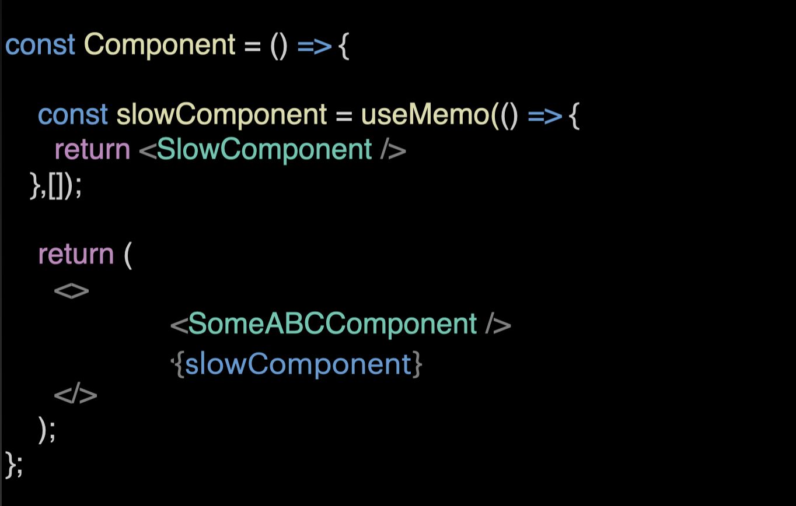

### Optimising Rerenders

```jsx
export const TodoApp = () => {
  const addItem = (name) => {
    setTodos((prevTodos) => [
      { id: prevTodos.length + 1, name: name, isCompleted: false },
      ...prevTodos,
    ]);
  };

  return <MemoedAddTodoItem addItem={addItem} />;
};
```

Everytime the component rerenders, new instance of `addItem` function would be created.

Since referential quality doesn't hold for non primitive values

function !== function

functions need to be wrapped inside useCallback and other non primitive values need to be wrapped inside `useMemo`

```jsx
export const TodoApp = () => {
  const addItem = useCallback((name) => {
    setTodos((prevTodos) => [
      { id: prevTodos.length + 1, name: name, isCompleted: false },
      ...prevTodos,
    ]);
  }, []);

  return <MemoedAddTodoItem addItem={addItem} />;
};
```

<b>When to use useMemo and useCallback?</b>

`UseMemo` and `useCallback` both cause extra computations. So wrapping every function or value inside useCallback or useMemo might not be very performant

1. If non primitive values are provided in Dependency array

   

2. If a component is slow, its good to memoize it
   

3. Computationally expensive calculations
   
